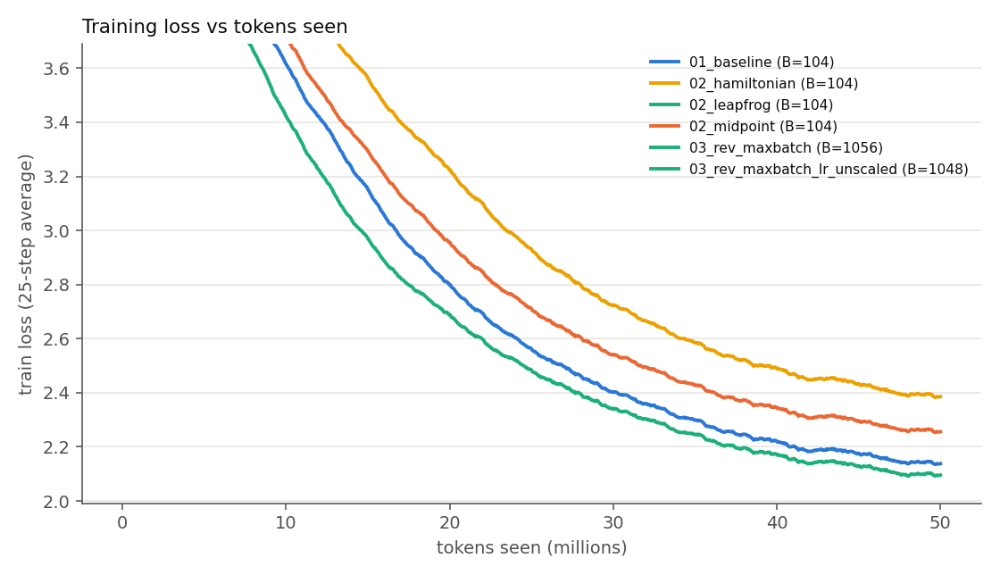
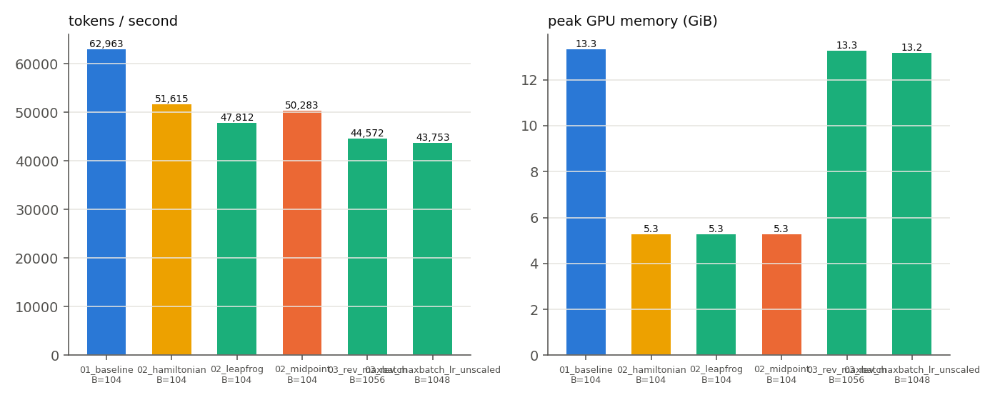

# Reversible training of a 20M-parameter LLM (ERA V5, Session 13)

> **Status.** All three notebooks have been run end to end on a Colab T4. Section 9 has the real numbers
> and Section 10 the findings drawn from them, copied from each notebook's own printed output and its
> `results/summary.md` table - nothing below is typed in from memory or guessed.

## 1. The assignment

Train a ~20M-parameter LLM on 50M tokens, three times, and report final loss, speed (tokens/s),
peak memory and other findings:

1. **Baseline** - ordinary transformer, the biggest batch size that fits on my GPU.
2. **Reversible** - same batch size, try the reversible variants (midpoint, Euler-style, leapfrog) and say which one works best.
3. **Reversible, maximum batch** - keep the best variant and push the batch size as far as one GPU allows.

Source: ERA V5 Session 13 (distributed training part 2) and the paper it is based on,
*Reversing Large Language Models for Efficient Training and Fine-Tuning* ([arXiv:2512.02056](https://arxiv.org/abs/2512.02056)).

| Notebook | What it does |
|---|---|
| [`notebooks/01_baseline.ipynb`](notebooks/01_baseline.ipynb) | finds the max batch for the normal model, trains 50M tokens |
| [`notebooks/02_reversible_variants.ipynb`](notebooks/02_reversible_variants.ipynb) | same batch, three reversible variants, picks the winner, memory-vs-depth test |
| [`notebooks/03_reversible_max_batch.ipynb`](notebooks/03_reversible_max_batch.ipynb) | pushes the batch size to the limit, trains 50M tokens, final report |

## 2. Reversibility in plain English

Training a neural network has two passes. The **forward pass** computes the answer. The **backward
pass** works out how to improve each weight. The backward pass needs the *intermediate numbers*
(activations) that the forward pass produced, so a normal network keeps all of them in GPU memory.
More layers, longer text or bigger batches all mean more stored numbers, and that is usually what
runs the GPU out of memory - not the weights.

A **reversible** network is built so that each layer's input can be calculated back from its output.
So the forward pass keeps *only the last layer's output* and throws the rest away. During the backward
pass, for each layer going from last to first:

1. rebuild that layer's input from its output (this is the "reverse" part),
2. run the layer once more to get the gradients,
3. move to the layer before it.

**The trade:** memory for activations stops growing with the number of layers, but every layer's forward
computation is done twice, so training is slower per step (the paper and the session both say roughly
30-50% slower per step). The hope is that the freed memory allows a much bigger batch, which wins some
of the speed back.

**The price of the trick:** the layer function must be invertible by construction, and anything random
inside a layer (dropout) would have to be replayed exactly. I use no dropout.

## 3. The update rules I compare

Every block below is the *same* transformer block (attention + MLP, same weights). Only the way the
block's result is added to the running state changes. Let `f(x)` = "block(x) minus x", i.e. what the
block adds.

| name | forward rule | how to go backwards | reversible? |
|---|---|---|---|
| `baseline` (forward Euler) | `x[l+1] = x[l] + f(x[l])` | - (needs stored activations) | no |
| `midpoint` | `x[l+1] = x[l-1] + 2h * f(x[l])` | `x[l-1] = x[l+1] - 2h * f(x[l])` | yes |
| `leapfrog` | `x[l+1] = 2x[l] - x[l-1] + h^2 * f(x[l])` | `x[l-1] = 2x[l] - x[l+1] + h^2 * f(x[l])` | yes |
| `hamiltonian` (symplectic Euler) | `q' = q + Attn(p)` then `p' = p + MLP(q')` | `p = p' - MLP(q')` then `q = q' - Attn(p)` | yes |

- `midpoint` and `leapfrog` keep **two** states (the previous and the current layer's output). To go
  backwards you need the last two, then each step recovers one more.
- `hamiltonian` keeps two streams, `p` and `q`, and updates them one after the other. It is the
  "Euler-style" variant: the baseline is plain forward Euler, and this is its reversible sibling.
- `h` is a fixed step size. I use `h = 0.5`, so midpoint's `2h = 1` matches the baseline's step size.
  I did not tune it. Notebook 02 has an optional switch (`RUN_H_SWEEP`) that tries 0.25 / 0.5 / 1.0.

All four modes have **exactly the same parameters and the same starting weights** (checked by a test), so
any difference in loss, speed or memory comes from the update rule alone.

Choices that are mine, not the paper's (see section 8): both starting states are the embedding, the
readout is the latest state (`p` for hamiltonian), and there is no dropout.

## 4. Setup

| | |
|---|---|
| model | GPT-style, pre-LayerNorm, **14 blocks, d_model 320, 5 heads, MLP 4x, context 512**, tied input/output embedding, learned positions |
| parameters | **20,007,040** (counted by the code) |
| tokenizer | byte-level BPE, **8,192 tokens**, trained on 50k TinyStories stories |
| data | [TinyStories](https://huggingface.co/datasets/roneneldan/TinyStories) train split, exactly **50,000,000 tokens**, each seen once (one epoch, fixed shuffled order). 1M tokens of the validation split for validation loss |
| optimizer | AdamW, betas (0.9, 0.95), weight decay 0.1 on weight matrices, grad-clip 1.0, 2% warm-up then cosine to 10% |
| learning rate | peak `1e-3 * sqrt(batch / 64)`, capped at `2e-3` (so every run uses the same rule) |
| precision | fp16 autocast + loss scaling on a T4 (no fast bf16 there); the running state between layers is kept in fp32 |
| batch | no gradient accumulation - "batch size" means what one GPU step really holds |
| seeds | same seed and same data order for every run |

**Why an 8k vocabulary?** With GPT-2's 50k vocabulary the embedding table alone would be about 16M of the
20M parameters, leaving almost nothing for the layers. Reversibility works on the layers, so I wanted the
20M budget to be spent there.

## 5. What is in this repo

```
revlm/
  model.py         the GPT and the four update rules
  reversible.py    the memory-saving backward pass (the core idea, ~100 lines)
  data.py          TinyStories -> BPE -> one flat file of exactly 50M tokens
  train.py         training loop; records loss, tokens/s, peak memory
  bench.py         short speed/memory tests, max-batch search, depth scaling
  experiment.py    settings + resumable runs shared by the notebooks
  report.py        plots and the summary table (built from results/*.json)
  selftest.py      correctness checks (run at the top of every notebook)
notebooks/         01, 02, 03 (built by tools/build_notebooks.py)
tests/             pytest versions of the correctness checks
results/           written by the notebooks: one JSON per run, plots, summary.md
```

## 6. How to reproduce

1. Put this folder in a GitHub repo. Open `notebooks/01_baseline.ipynb` in Google Colab
   (`File > Open notebook > GitHub`), choose **Runtime > Change runtime type > GPU**.
2. In the first cell edit `REPO_URL` to your repo, then *Run all*. The first cell installs two small
   libraries, and the second runs the self-test (about 30 seconds) - stop if it says a check failed.
3. Run notebook 02, then notebook 03. They read the batch size and the winning variant from `results/`.
4. Every run saves its own JSON, so if Colab disconnects you can run again and finished runs are skipped.
   Set `USE_DRIVE = True` to keep data and results on Google Drive across sessions (the 50M-token file is
   rebuilt in a few minutes otherwise).
5. When done: `File > Save a copy in GitHub` for each notebook so the version with outputs is in the repo,
   and commit the `results/` folder.

`SMOKE = True` at the top of a notebook runs a tiny CPU version (about 1M parameters, 0.3M tokens) to test
the code. Its numbers mean nothing.

## 7. What I have verified so far (CPU only, no GPU available when this was written)

Run `python -m pytest tests` (7 tests) or `python -m revlm.selftest`.

| Check | Result |
|---|---|
| All four modes have the same parameter count and identical initial weights | passes |
| Rebuilding a layer's input from its output (float64) | max error about 1e-15 for all three variants |
| Memory-saving backward vs ordinary autograd, gradients of every parameter (float64) | relative difference about 1e-15 for all three variants |
| Same check under mixed precision (bf16 on CPU) | gradient cosine similarity 1.00000 |
| Chunked loss vs normal loss (see 8.3) | identical value and gradients |
| Max-batch search logic against a fake GPU with known limits | finds the limit to within 8 |
| Whole notebooks executed end to end in `SMOKE` mode | all three run without errors |
| Tiny CPU training, all four modes | all four learn (loss falls from 9.0 to about 3.7) and none diverges |

**Memory, measured without a GPU.** I counted the bytes autograd keeps for the backward pass ("saved
tensors"). This is not peak GPU memory, but it is hardware independent:

| Number of blocks (tiny test model) | 2 | 4 | 8 | 16 |
|---|---:|---:|---:|---:|
| baseline, bytes saved | 507,844 | 923,972 | 1,756,228 | 3,420,740 |
| reversible (midpoint), bytes saved | 110,148 | 110,148 | 110,148 | 110,148 |

For the real 20M model (ctx 512, bf16 autocast as a stand-in for fp16) the extra saved bytes per extra
token were **232.6 KiB/token for the baseline vs 68.4 KiB/token for the reversible modes**. Most of the
reversible number is the output logits (`vocab x tokens`), not the layers - see 8.3.

**What is not verified yet:** the GPU path itself - fp16 with loss scaling on a T4, the real out-of-memory
search, and real speed. The self-test at the top of each notebook re-checks the gradient agreement on the
GPU (including fp16) before any long run starts.

## 8. Design notes and honest caveats

### 8.1 "Euler" and the transcript
The session transcript is auto-generated and garbles the names ("boiler", "oiler"). I read the instructor
as asking for midpoint against an Euler-style rule. The paper's reversible Euler-style scheme is the
Hamiltonian (symplectic Euler) one, so that is what `hamiltonian` is. I added `leapfrog` because it is the
paper's third rule and costs one extra run. If your instructor meant something else, the three variants are
one flag (`mode`) apart.

### 8.2 Weight decay and dropout
The transcript says reversibility rules out weight decay and dropout. I believe only half of that is right.
Dropout does conflict, because a random mask would have to be replayed exactly when rebuilding the input, so I use none.
Weight decay only changes the weights *after* the backward pass, and the rebuild inside a step uses the same
weights as the forward pass in that step, so it does not conflict. I therefore use weight decay 0.1 in
**all** runs, so the comparison stays fair. The same transcript is auto-generated, so this may also be a
transcription slip.

### 8.3 The output logits become the bottleneck
Reversibility removes the per-layer activations. It does not touch the logits (`tokens x 8,192 x` a few
bytes), which for a 20M-parameter model are a large share of what is left. So the maximum batch will not
grow without limit. Notebook 03 therefore also tries a **chunked loss**: logits are computed a slice at a time
and recomputed in the backward pass, so the full logits never exist at once. The maths is unchanged (tested);
only memory and a little speed change. I report both.

Measured: the chunked-loss search found a larger batch than the plain-loss search, and the chunked version is
what notebook 03 trained at (`chunked loss = True`, batch 1056 - see 9.1). So on this model the logits really
were part of what was limiting the batch, and chunking bought real headroom beyond reversibility alone.

### 8.4 A huge batch means few steps
For a fixed 50M tokens, a batch of 400 sequences (about 205k tokens) gives only about 240 optimizer steps.
The loss after the same number of *tokens* will very likely be worse than at a small batch. That would be a
property of large-batch training, not a fault of reversibility. Notebook 03 trains once with the learning
rate scaled up as `sqrt(batch)` and once with it unscaled, so the effect is visible.

### 8.5 Speed comparison is only fair at equal batch
Reversible steps at the same batch are slower (extra forward per layer). Reversible training only wins on
speed if the larger batch it allows raises GPU utilisation enough. I therefore report tokens/s at the fixed
batch (notebook 02) and at each variant's own maximum (notebook 03) separately.

### 8.6 Choices not taken from the paper
Both starting states are the embedding (`x[0] = x[1]`); the network output is the latest state (for
`hamiltonian` the `p` stream); each transformer block is one reversible step. These are reasonable choices,
not verified against the paper's code. Small-model results here are not a claim about large models.

## 9. Results

All numbers below are copied from the notebooks' own printed output and `results/summary.md` on a
Colab T4 (16 GB), fp16 autocast with loss scaling. Nothing here is estimated.

### 9.1 Batch sizes found

| model | max batch (sequences of 512 tokens) | note |
|---|---:|---|
| baseline | **104** | `results/maxbatch_baseline.json` |
| reversible (leapfrog), plain loss | smaller than the chunked figure below | `results/maxbatch_rev_plainloss.json` has the exact number |
| reversible (leapfrog) + chunked loss | **1056** | this is what notebook 03 actually trained at - the chunked search won |

The chunked-loss search found a bigger batch than the plain one, so notebook 03 trained with it
(`chunked loss = True`). That confirms the logits really were the next thing limiting the batch once
the per-layer activations were gone (section 8.3).

### 9.2 All runs

| run | mode | batch | steps | tokens seen | final train loss | final val loss | tokens/s (median) | peak mem (GiB) | wall time (min) | est. cost ($) |
|---|---|---:|---:|---:|---:|---:|---:|---:|---:|---:|
| 01_baseline | baseline | 104 | 939 | 50.0M | 2.1417 | 2.1885 | 62,963 | 13.32 | 14.2 | 0.08 |
| 02_midpoint | midpoint | 104 | 939 | 50.0M | 2.2606 | 2.3055 | 50,283 | 5.28 | 17.8 | 0.10 |
| 02_leapfrog | leapfrog | 104 | 939 | 50.0M | 2.0984 | 2.1478 | 47,812 | 5.28 | 18.5 | 0.11 |
| 02_hamiltonian | hamiltonian | 104 | 939 | 50.0M | 2.3914 | 2.4389 | 51,615 | 5.28 | 17.1 | 0.10 |
| 03_rev_maxbatch (winner: leapfrog, LR scaled) | leapfrog | 1056 | 92 | 49.7M | 4.9845 | 4.6963 | 44,572 | 13.27 | 19.8 | 0.12 |
| 03_rev_maxbatch_lr_unscaled | leapfrog | 1048 | 93 | 49.9M | 4.0121 | 3.9478 | 43,753 | 13.17 | 20.1 | 0.12 |

**Winner of notebook 02: leapfrog**, the lowest validation loss of the three reversible variants, and
slightly lower than the baseline's at the same batch size (2.1478 vs 2.1885). None of the runs diverged.

The unscaled-LR run used batch 1048, 8 less than the scaled run's 1056 - the code's automatic
out-of-memory retry (section 6, point 4) stepped the batch down once for that run. Same model, same
data, same code; the GPU simply had 8 sequences' less headroom free that time, which is a reminder that
a batch size found "at the limit" isn't perfectly repeatable to the last sequence.

Total: 6 runs, 107.5 minutes of GPU time, about $0.63 at the $0.35/hour I assumed in notebook 03 (edit
`PRICE_PER_HOUR` there for your own provider's rate).

`tokens/s` is the median over training steps after a 20-step warm-up, including data loading and excluding
validation. `peak mem` is `torch.cuda.max_memory_allocated()` during training steps only. `est. cost` uses
the price per GPU-hour I typed into notebook 03 - it is an assumption, not a measurement.

### 9.3 Plots

Written by the notebooks to `results/loss_curves.png`, `results/speed_memory.png`,
`results/depth_scaling.png` and `results/ctx_scaling.png`. Once you push your `results/` folder to
GitHub these render automatically wherever this README is viewed there:




## 10. Findings

**1. Which reversible variant won, and did any diverge?** Leapfrog, with the lowest validation loss of
all four modes at the fixed batch size (2.1478), edging out even the baseline (2.1885) - about a 2%
relative improvement. Midpoint (2.3055) and hamiltonian (2.4389) both trained fine but landed behind the
baseline. Nothing diverged. I would not read "leapfrog beats the baseline" as a settled result from a
single seed and a single run each - it shows leapfrog is at least competitive while using well under
half the memory, not that it is definitively better.

**2. How much slower is a reversible step at equal batch?** 18-24% slower (midpoint 20%, leapfrog 24%,
hamiltonian 18%), against my pre-run guess of 25-40% based on the paper's own figure. Real, but milder
than the paper's number on this model and this GPU.

**3. Memory at equal batch.** Fell from 13.32 GiB to 5.28 GiB for all three reversible variants - almost
identical across variants, which is a good consistency check since they share the same two-state memory
pattern. About a 60% reduction, or 2.5x.

**4. How much bigger a batch fits, and what was the limit?** 10x bigger (104 -> 1056), and only with the
chunked loss switched on - the plain reversible search topped out lower (9.1). That means once the
per-layer activations are gone, the output logits (`batch x context x vocab`) become the next ceiling,
exactly as section 8.3 expected; chunking that away is what let the batch grow the rest of the way. This
is a bigger jump than my pre-run guess of about 3x, which came from a rough CPU-only measurement that
didn't account for chunking.

**5. What did the giant batch do to loss?** It got much worse - val loss 4.6963 (scaled LR) or 3.9478
(unscaled), against 2.1478 at the fixed batch. The reason is steps, not reversibility: 92-93 optimizer
updates instead of 939 for the same ~50M tokens. Seeing the tokens isn't the same as learning from them
when each step now covers ten times as much data. This matches the caution in section 8.4, and the
GPU run shows it's a large effect, not a minor one - loss more than doubled.

**Surprise finding: the "unscaled" learning-rate control beat the "scaled" run** (val loss 3.9478 vs
4.6963) - the opposite of what the `sqrt(batch)` scaling rule is meant to deliver. My read: with only
about 92 steps total, the code's minimum warm-up (10 steps) eats over 10% of the entire run regardless of
schedule, and the scaled run's peak learning rate hit its cap of 2e-3 - double the unscaled run's 1e-3.
At this few a step, the higher peak rate looks to have made optimization noisier rather than more
effective. This isn't a case against learning-rate scaling in general - it's a sign that the standard
advice assumes enough steps remain for the schedule to do its job, and at 92 steps that assumption breaks.
**[Likely]**, not certain, since it's one run each.

**6. Speed at the pushed batch.** 44,572 tok/s (scaled) / 43,753 tok/s (unscaled) - both *lower* than the
fixed-batch leapfrog run (47,812 tok/s), and well below the baseline (62,963 tok/s), even though a much
bigger batch would normally be expected to use the GPU more efficiently. Most likely explanation: the
chunked-loss recomputation (each logit chunk is computed twice - once in the forward pass, once again
in the backward pass) adds overhead that outweighs the batch-size gain at this scale, and running this
close to the GPU's memory ceiling may add allocator overhead of its own. I haven't isolated which of the
two matters more - that would need a chunked-vs-not comparison at the same batch, which the notebooks
don't currently run.

**7. Cost, with vs without reversibility (the question raised in the session transcript).** At the same
batch, reversible costs about 25-30% more per run than the baseline ($0.10-0.11 vs $0.08) - slower steps,
same token count. Pushed to its own maximum batch it costs a little more again ($0.12), for a *worse*
result here, because the token budget got spread across too few steps. So reversibility's payoff in this
experiment isn't a cheaper run - it's unlocking a batch size the baseline physically cannot fit at all;
that only pays off once there's also a large enough token budget to give it enough steps to use.

### Predictions made before the GPU runs, checked against what happened

| prediction | tag | actual |
|---|---|---|
| memory saved for backward stays flat as blocks are added | [Certain] | held: same ~5.28 GiB across all three reversible variants |
| reversible steps ~25-40% slower at equal batch | [Likely] | milder: 18-24% |
| largest batch grows by roughly 3x | [Likely] | grew 10x, because chunking the loss added more headroom than the CPU-only estimate accounted for |
| baseline batch on a T4 "around 64-128" | [Guessing] | landed right in range: 104 |
| reversible batch "a few hundred" | [Guessing] | too low: 1056 |
| which variant wins on loss | [Guessing] | leapfrog, not called in advance |

## 11. References

- *Reversing Large Language Models for Efficient Training and Fine-Tuning*, arXiv:2512.02056 - the midpoint, leapfrog and Hamiltonian reversible rules used here.
- ERA V5 Session 13 transcript - assignment text and the reversibility discussion.
- TinyStories dataset, `roneneldan/TinyStories` on Hugging Face.
